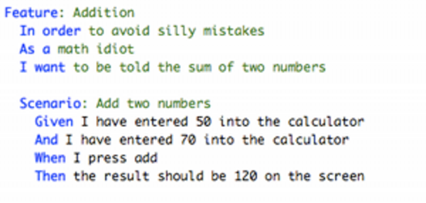
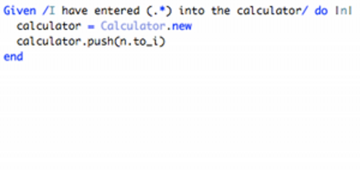
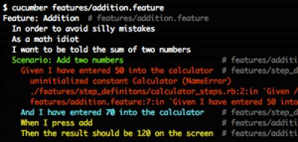
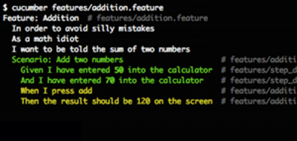
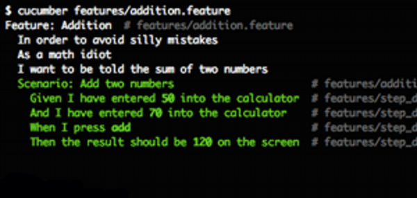

!SLIDE
# Cucumber

    Feature: Awesome Ruby Programmer
      In order to quickly finish with a project
      As a product owner
      I want to have the best Ruby programmers

      Scenario: Code a project from scratch
        Given I'm an awesome programmer
        And no code has been written
        When I sit down to code the project
        Then it's completed in a second

!SLIDE bullets
## There has been [a cucumber presentation](http://www.viddler.com/explore/budapestrb/videos/1/) on a budapest.rb meetup

!SLIDE smbullets center

1. Describe behaviour in plain text

!SLIDE smbullets center

1. Describe behaviour in plain text
2. Write a step definition in Ruby

!SLIDE smbullets center

1. Describe behaviour in plain text
2. Write a step definition in Ruby
3. Run and watch it fail

!SLIDE smbullets center

1. Describe behaviour in plain text
2. Write a step definition in Ruby
3. Run and watch it fail
4. Write code to make the step pass

!SLIDE smbullets center

1. Describe behaviour in plain text
2. Write a step definition in Ruby
3. Run and watch it fail
4. Write code to make the step pass
5. Run again and see the step pass

!SLIDE smbullets center

1. Describe behaviour in plain text
2. Write a step definition in Ruby
3. Run and watch it fail
4. Write code to make the step pass
5. Run again and see the step pass
6. Repeat 2-5 until green like a cuke

