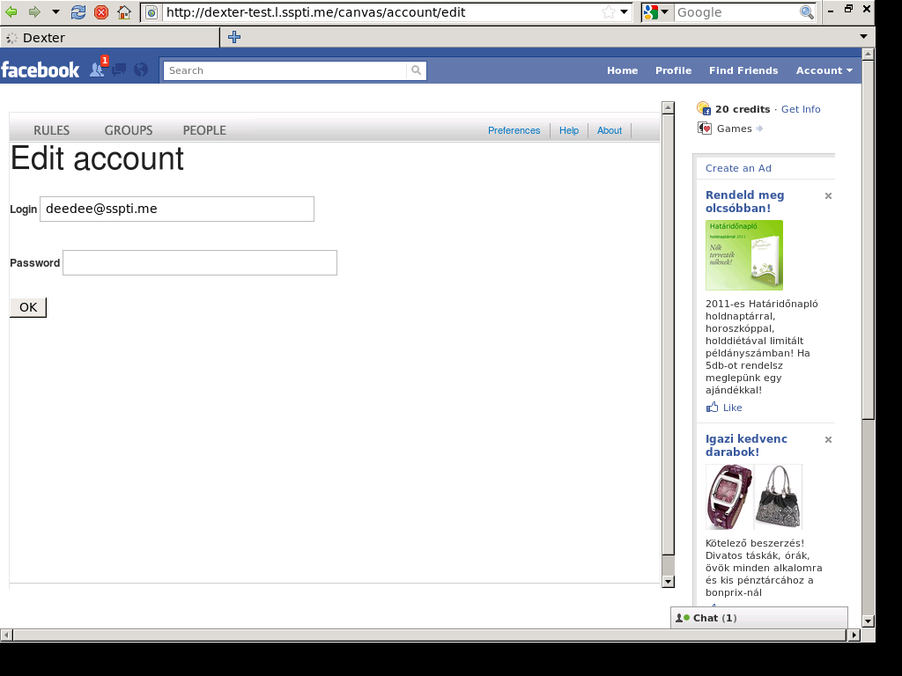

!SLIDE
# Tips and Tricks

!SLIDE
## Use [Capybara](http://github.com/jnicklas/capybara) with Selenium by default

    @@@ Ruby
    # features/support/env.rb
    require 'capybara/rails'
    require 'capybara/cucumber'
    require 'capybara/session'
    Capybara.default_driver = :selenium

!SLIDE
## Use Capybara with Selenium just for Javascript

    @@@
    @javascript
    Scenario: Do it with lots of JavaScript magic

!SLIDE bullets incremental
## Even more magic

* `features/support/selenium.rb`

!SLIDE
## Stop on error

    @@@ Ruby
    After('@wip', '@javascript') do |scenario|
      if scenario.failed?
        puts "The last scenario failed and it was tagged with @wip and @javascript"
        print "What do you want to do? [[c]ont./cont. but [k]eep browser open/[d]ebug] "
        case $stdin.gets.chomp
        when /^d/i  then debugger
        when /^k/i  then Capybara::Driver::Selenium.keep_open!
        end
        true # to keep debug session in scope
      end
    end

!SLIDE center
## Create screenshot on error

!SLIDE center

!SLIDE
## Create screenshot implementation

    @@@ Ruby
    After('@javascript') do |scenario|
      if scenario.failed?
        Rails.root.join("screenshots").mkpath
        screenshot = Rails.root.join("screenshots", scenario.file_colon_line.tr('/.:', '-')+".png")
        page.driver.browser.save_screenshot screenshot.to_s
        puts "Saved screenshot of failed @javascript scenario to #{screenshot}"
      end
    end

!SLIDE
## Give me my dear FireBug back!

    @@@ Ruby
    # Custom WebDriver with FireBug
    class Capybara::Driver::Selenium
      def self.driver
        unless @driver
          profile = Selenium::WebDriver::Firefox::Profile.new
          profile.add_extension(File.join(File.dirname(__FILE__), "firebug-1.5.4-fx.xpi"))
          profile['extensions.firebug.console.enableSites'] = true
          profile['extensions.firebug.script.enableSites'] = true
          profile['extensions.firebug.net.enableSites'] = true
          profile['extensions.firebug.defaultPanelName'] = 'console'
          @driver = Selenium::WebDriver.for :firefox, :profile => profile
          at_exit do
            @driver.quit unless @keep_driver_open
          end
        end
        @driver
      end

      def self.keep_open!
        @keep_driver_open = true
      end
    end

!SLIDE
# Demo

!SLIDE bullets
# Thank you! Questions?

* [Cucumber](http://cukes.info/)
* [Selenium Webdriver](https://rubygems.org/gems/selenium-webdriver)
* [Capybara](http://github.com/jnicklas/capybara)
* Me: [László Bácsi](http://github.com/lackac)
* [This presentation](http://github.com/lackac/showoff-cucumber-selenium/)
